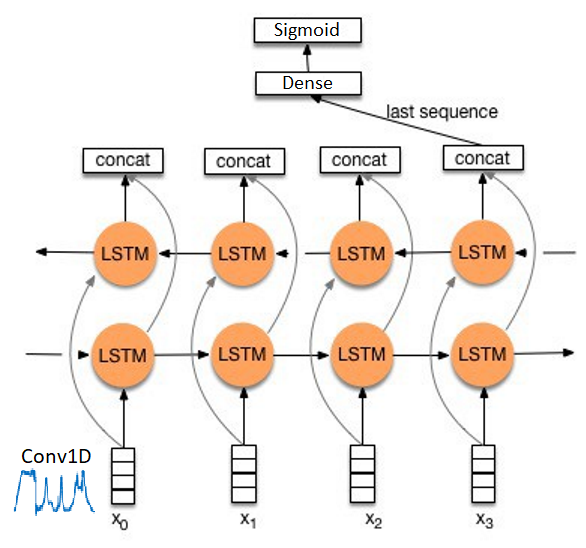

# Goal of this repository

Provide toolkit to power Infosec with Data Science techniques.  

This particular repository contains all necessary code to perform preprocessing of Sysmon Events and supply them to Recurrent Neural Network.

# Sysmon Event example
```
  <Event xmlns="http://schemas.microsoft.com/win/2004/08/events/event">
    <System>
      <Provider Name="Microsoft-Windows-Sysmon" Guid="{5770385f-c22a-43e0-bf4c-06f5698ffbd9}"/>
      <EventID>11</EventID>
      <Version>2</Version>
      <Level>4</Level>
      <Task>11</Task>
      <Opcode>0</Opcode>
      <Keywords>0x8000000000000000</Keywords>
      <TimeCreated SystemTime="2020-05-12T15:05:19.496049000Z"/>
      <EventRecordID>13787</EventRecordID>
      <Correlation/>
      <Execution ProcessID="1932" ThreadID="4416"/>
      <Channel>Microsoft-Windows-Sysmon/Operational</Channel>
      <Computer>DESKTOP-TATBGQH</Computer>
      <Security UserID="S-1-5-18"/>
    </System>
    <EventData>
      <Data Name="RuleName">-</Data>
      <Data Name="UtcTime">2020-05-12 15:05:19.493</Data>
      <Data Name="ProcessGuid">{5919995d-9476-5eba-6c00-000000000600}</Data>
      <Data Name="ProcessId">5380</Data>
      <Data Name="Image">C:\Windows\Explorer.EXE</Data>
      <Data Name="TargetFilename">C:\Users\anon\AppData\Roaming\Microsoft\Windows\Recent\xmlEvents2.lnk</Data>
      <Data Name="CreationUtcTime">2020-05-12 15:05:19.493</Data>
    </EventData>
  </Event>
  ```

# RNN
Most efficient RNN model:  


```
model = keras.models.Sequential([
            keras.layers.Conv1D(filters=64, kernel_size=3, activation='relu', input_shape=[MAX_TIMESTEPS, OH_DIMENSION]),
            keras.layers.MaxPooling1D(pool_size=2),
            keras.layers.Bidirectional(keras.layers.LSTM(64, dropout=0.2, recurrent_dropout=0.2)),
            keras.layers.Dropout(0.5),
            keras.layers.Dense(32, activation='relu'),
            keras.layers.Dense(1, activation='sigmoid')
])
return model
```
